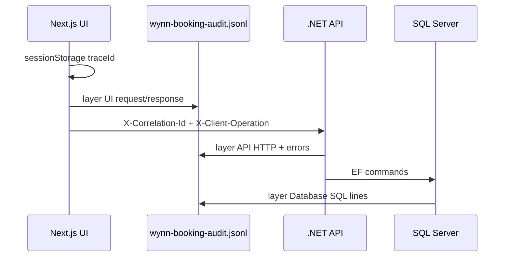

# Unified audit logging (UI → API → Database)

One correlated trail for demos and interviews: every layer appends to the same file.

## File location

| Runtime | Default path |
|---------|----------------|
| All | `logs/wynn-booking-audit.jsonl` (repo root) |

Override:

- **UI / Next.js:** `AUDIT_LOG_PATH` (absolute or relative to project root)
- **API:** `AuditLog:Path` in `appsettings.json` (relative to `backend/Wynn.Booking.Api`)

The file is gitignored (`logs/*.jsonl`). Create `logs/` automatically on first write.

## Correlation model



1. Browser generates a **session trace id** (`lib/logging/correlation.ts`) and stores it in `sessionStorage`.
2. Every .NET call goes through `auditApiFetch` (`lib/logging/audit-api-fetch.ts`) with:
   - `X-Correlation-Id` — same id the API uses as `traceId` in JSON responses
   - `X-Client-Operation` — stable name, e.g. `rooms.search`, `bookings.createMember`
3. API middleware (`CorrelationIdMiddleware`) accepts or creates the id and echoes it on the response.
4. EF `DbCommandAuditInterceptor` logs SQL with the same trace id from `HttpContext`.

## Grep one booking flow (demo script)

After a room search + login + booking:

```bash
# Pick trace id from the latest UI line (browser devtools → Network → response traceId, or file tail)
TRACE="<paste-32-char-id>"
grep "$TRACE" logs/wynn-booking-audit.jsonl | jq -c .
```

You should see lines in order:

| `layer` | Example `operation` / message |
|---------|-------------------------------|
| `UI` | `rooms.search` phase `request` / `response` |
| `API` | `HTTP GET /api/Rooms` with `Operation=rooms.search` |
| `Database` | `SQL Text` duration for availability query |
| `UI` | `bookings.createMember` … |
| `API` | `HTTP POST /api/Bookings` |
| `Database` | `INSERT` / `SELECT` for booking |

UI lines use explicit fields: `timestamp`, `level`, `layer`, `traceId`, `memberId`, `operation`, `phase`.

API/DB lines use **Serilog Compact JSON** (`@t`, `@l`, `@mt`, plus `TraceId`, `Layer`, `Operation`, `MemberId`).

## Switching sink: file → database

Configuration only — no change to controllers or React pages.

### API (Serilog)

1. Add package `Serilog.Sinks.MSSqlServer`.
2. Set `AuditLog:Sink` to `Database` and configure the sink in `Program.cs` (commented pattern in repo):

```csharp
// When AuditLog:Sink == "Database":
// .WriteTo.MSSqlServer(connectionString, new MSSqlServerSinkOptions { TableName = "AuditLogs" })
```

Map columns to `TraceId`, `Layer`, `Operation`, `MemberId`, `Message`, `@t`.

### UI

Today: browser → `POST /api/diagnostics/log` → `appendAuditEvent` (file).

For production: set `AUDIT_LOG_SINK=database` and implement `lib/logging/audit-sink.ts` (interface + file/db providers) — same `AuditLogEvent` shape.

## Interview talking points

1. **End-to-end observability without a paid APM** — one id ties UI intent (`X-Client-Operation`) to HTTP completion and SQL.
2. **Provider pattern** — business code calls `auditApiFetch` / Serilog; destination is config (file vs SQL vs Application Insights).
3. **Security** — `MemberId` / `MemberEmail` only after JWT; **never** log `accessToken`, `Authorization`, or passwords (see [SECURITY.md](./SECURITY.md)); guest flows omit member fields; do not ship audit files with PII to public buckets.
4. **Failure isolation** — UI logging swallows errors so booking never fails because logging failed.
5. **Pacific hotel dates** — separate concern (`DateHelpers`); logging proves *which* API call failed when dates disagree.

## Code map

| Piece | Path |
|-------|------|
| UI fetch wrapper | `lib/logging/audit-api-fetch.ts` |
| Browser → file route | `app/api/diagnostics/log/route.ts` |
| .NET correlation | `backend/.../Middleware/CorrelationIdMiddleware.cs` |
| Member enrichment | `backend/.../Middleware/MemberAuditEnrichmentMiddleware.cs` |
| SQL audit | `backend/.../Persistence/DbCommandAuditInterceptor.cs` |
| Audit path | `backend/.../Logging/AuditLogPathResolver.cs` |

## Legacy paths (deprecated)

- `logs/application.log` — replaced by unified audit file for legacy `app/api/*` routes (still via `lib/logger` → same jsonl).
- `backend/Wynn.Booking.Api/logs/wynn-booking-api-*.log` — removed; use `wynn-booking-audit.jsonl` only.
